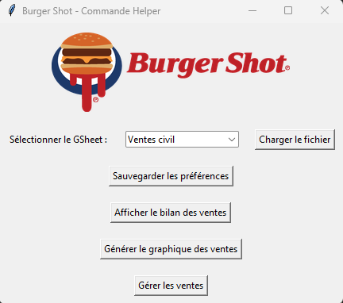

# Burger Shot Commande Helper 🍔👍

**Gestion des commandes de Burger Shot en un clic 💻**

Ce script est un outil d'aide pour la gestion des commandes de Burger Shot. Il permet de gérer les ventes, les clients et les préférences de manière efficace et intuitive. 🤩

**Capture d'écran de l'interface graphique**

# 

**Fonctionnalités 🎉**

* **Gestion des ventes** : affichage des ventes, modification des ventes, sauvegarde des ventes 📊
* **Gestion des clients** : affichage des clients, ajout de clients 👥
* **Gestion des préférences** : sauvegarde des préférences 📝
* **Intégration avec Google Sheets** pour la gestion des données 📊

**Utilisation 📚**

1. Exécutez le script `main.py` pour lancer l'application. 💻
2. Sélectionnez le fichier Google Sheets que vous souhaitez utiliser pour la gestion des données. 📁
3. Affichez les ventes et les clients en utilisant les boutons correspondants. 👀
4. Modifiez les ventes et les clients en utilisant les formulaires correspondants. 📝
5. Sauvegardez les préférences en utilisant le bouton "Sauvegarder les préférences". 💾

**Configuration 🔧**

* **Fichier de configuration** : `api_key.json` pour la configuration de l'API Google Sheets. 🔑
* **Fichier de sauvegarde** : `ventes.json` pour la sauvegarde des ventes. 📁
* **Fichier de sauvegarde** : `clients.json` pour la sauvegarde des clients. 👥

**Dépendances 📦**

* `tkinter` pour l'interface graphique 🎨
* `gspread` pour l'intégration avec Google Sheets 📊
* `oauth2client` pour l'authentification avec Google Sheets 🔑
* [json](cci:1://file:///f:/burger-shot-commande-helper/main.py:536:0-551:88) pour la sauvegarde des données 📁
* `matplotlib` pour la génération de graphiques 📊

**Changelog 📝**

* Version 1.0 : première version du script
* Version 1.1 : ajout de la fonctionnalité de sauvegarde des préférences
* Version 1.2 : correction de bugs et amélioration de la performance

**Prochaines étapes 🚀**

* Ajout de la fonctionnalité de génération de graphiques
* Amélioration de l'interface graphique
* Ajout de la fonctionnalité de notification

**Capture d'écran de la génération de graphiques**

