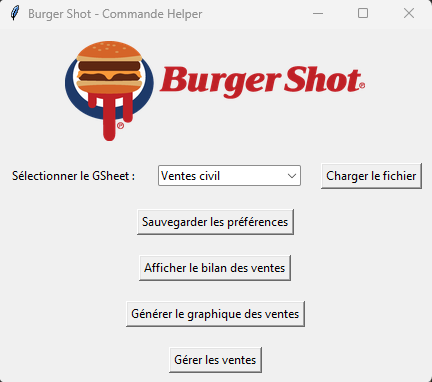
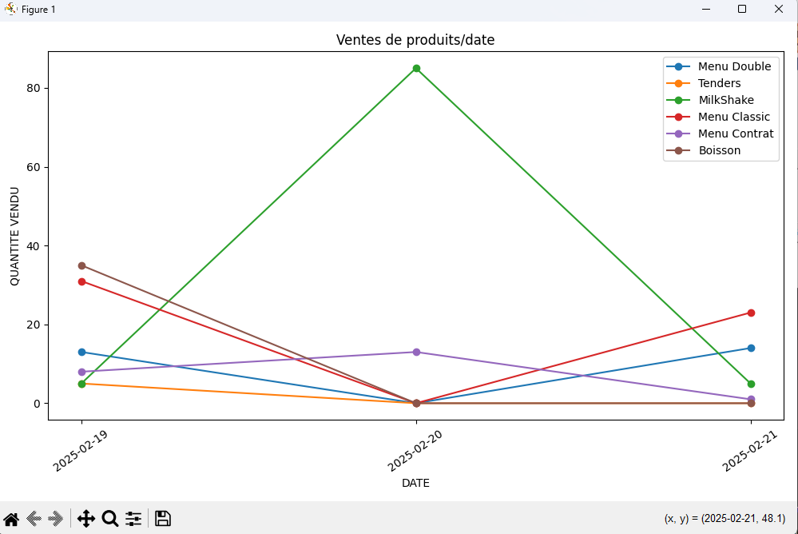

<div align="center">

# 🍔 Burger Shot Sales Analytics System

**Automated Sales Tracking & Data Pipeline — Server Project**

[](https://khalifouille.github.io/burger-shot-commande-helper/dashboard_burgershot.html)

[](https://www.python.org/)
[](https://developers.google.com/sheets/api)
[](https://discord.com/developers/docs/intro)
[](LICENSE)

*A data pipeline and analytics dashboard built for real-time sales tracking in a GTA V roleplay environment — turning in-game transactions into structured, exploitable data.*



</div>

---

## 📌 Project Context

This project was built for a **Burger Shot franchise** on a roleplay server, where sales had to be tracked manually per shift across multiple vendors and contract types. The solution automates the entire data flow — from point-of-sale entry to cloud storage, real-time reporting, and visual analytics.

What started as a simple helper script became a **full end-to-end data pipeline** covering ingestion, transformation, storage, visualization, and alerting.

---

## 🎯 Business Problem & Data Objectives

| Problem | Solution |
|---|---|
| Manual, error-prone sales tracking | Structured entry form with validation |
| No historical data retention | JSON-based local data lake + CSV export |
| No sales visibility between shifts | Real-time Discord webhook notifications |
| Inability to spot trends | Matplotlib time-series chart generation |
| Disconnected client data | Client registry with session persistence |

---

## 🏗️ Architecture & Data Flow

```
[User Input - Tkinter GUI]
         │
         ▼
[Data Validation Layer]
         │
    ┌────┴────┐
    ▼         ▼
[Google Sheets]    [Local JSON Store]
  (live ledger)      (data lake)
         │
    ┌────┴────┐
    ▼         ▼
[CSV Export]    [Matplotlib Charts]
(analytics)      (trend analysis)
         │
         ▼
[Discord Webhook — Real-time Alerts]
```

Two separate data streams are handled:
- **Civil sales** — product-level sales by vendor, aggregated per shift
- **Contract sales** — client-linked transactions with date tracking and checkbox validation

---

## 📊 Data & Analytics Features

### 🔄 Data Ingestion
- Dual Google Sheets integration (civil vs. contract pipelines)
- Automatic row detection and incremental updates via `gspread`
- Sheet-level routing based on transaction type

### 🗄️ Data Storage
- **JSON data lake** (`ventes.json`) — date-partitioned sales records persisted locally in `%APPDATA%`
- **Client registry** (`clients.json`) — entity store with sheet-level metadata
- **Preferences store** (`preferences.json`) — session state persistence

### 📈 Analytics & Reporting
- **Sales bilan (report)** — filterable by date range, product, and quantity threshold
- **Time-series visualization** — product sales trends plotted over time with Matplotlib
- **CSV export** — flat-file output for downstream analysis in Excel / Power BI / etc.
- **Revenue calculation** — real-time total based on configurable unit prices

### 🔔 Alerting
- Embedded Discord notifications with rich embeds on every confirmed sale
- Service log tracking (shift start/end, breaks with duration timer)

---

## 🛠️ Tech Stack

| Layer | Technology |
|---|---|
| Language | Python 3.10+ |
| GUI | Tkinter + tkcalendar |
| Cloud Data Store | Google Sheets (via `gspread` + OAuth2) |
| Local Data Store | JSON (file-based, `%APPDATA%`) |
| Visualization | Matplotlib |
| Alerting | Discord Webhook API (REST) |
| Export | CSV (standard library) |
| Auth | `oauth2client` — Service Account |

---

## 📁 Project Structure

```
burger-shot-analytics/
│
├── main.py                  # Core application — GUI + data logic
├── webhook.py               # Discord credentials (gitignored)
├── api_key.json             # Google Sheets service account (gitignored)
│
├── preferences.json         # User session config
├── clients.json             # Client registry
│
├── bs.png                   # App branding
├── interface_graphique.png  # UI screenshot
├── generation_graphiques.png# Analytics screenshot
│
└── README.md
```

---

## 🚀 Getting Started

### Prerequisites

```bash
pip install gspread oauth2client pillow tkcalendar matplotlib requests
```

### Google Sheets API Setup

1. Create a project in [Google Cloud Console](https://console.cloud.google.com/)
2. Enable the **Google Sheets API** and **Google Drive API**
3. Create a **Service Account** and download the key as `api_key.json`
4. Share your Google Sheets file with the service account email

### Discord Webhook Setup

Create a `webhook.py` file (gitignored) with:

```python
WEBHOOK_URL = "your_webhook_url"
USER_TOKEN  = "your_user_token"
CHANNEL_ID  = "your_channel_id"
```

### Run

```bash
python main.py
```

---

## 📉 Data Schema

### `ventes.json` — Sales Data Lake

```json
{
  "2025-04-19": {
    "Menu Classic": 12,
    "Menu Double": 5,
    "Boisson": 18,
    "Milkshake": 7
  }
}
```

### `clients.json` — Client Registry

```json
{
  "clients": ["Client A", "Client B"],
  "clients_feuilles": {
    "Client A": "Organisme X",
    "Client B": "Organisme Y"
  }
}
```

### Unit Prices Reference

| Product | Price ($) |
|---|---|
| Menu Classic | 100 |
| Menu Double | 120 |
| Menu Contrat | — |
| Tenders | 60 |
| Petite Salade | 60 |
| Boisson | 30 |
| Milkshake | 40 |

---

## 📸 Screenshots

<div align="center">

**Sales Entry Interface**


**Sales Trend Chart (Matplotlib)**


</div>

---

## 💡 Key Learnings & Data Skills Demonstrated

- **ETL pipeline design** — extraction from UI input, transformation via business logic, loading into both a cloud ledger and a local store
- **API integration** — Google Sheets REST API for live read/write operations, Discord Webhook API for push notifications
- **Data modeling** — schema design for date-partitioned JSON records and a relational client-to-sheet mapping
- **Analytical reporting** — filterable date-range reports, aggregations, and revenue calculations
- **Data visualization** — time-series charts with multi-product overlay using Matplotlib
- **Data export pipeline** — JSON → CSV conversion for downstream tooling compatibility
- **State management** — session persistence across application restarts via local JSON configs

---

## 🗺️ Roadmap / Potential Improvements

- [ ] **Dashboard web** — migrate from Tkinter to a Streamlit or Dash web app
- [ ] **Database backend** — replace JSON store with SQLite or PostgreSQL
- [ ] **Power BI / Tableau integration** — expose data via a REST API or direct connector
- [ ] **Automated reporting** — scheduled PDF/email reports via cron job
- [ ] **Statistical analysis** — peak hours, best-selling products, vendor performance KPIs
- [ ] **Data quality layer** — anomaly detection and input validation rules

---

## 📜 License

This project is licensed under the [MIT License](LICENSE).
