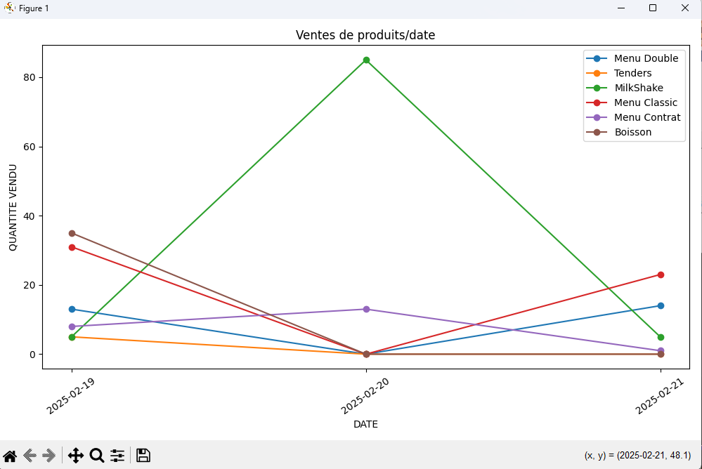

     

# Burger Shot Commande Helper 🍔👍

**Gestion des commandes de Burger Shot en un clic 💻**

Ce script est un outil d'aide pour la gestion des commandes de Burger Shot. Il permet de gérer les ventes, les clients et les préférences de manière efficace et intuitive. 🤩

## Fonctionnalités 🎉

### Gestion des ventes 📊
- **Affichage des ventes** : Affiche les ventes enregistrées dans le fichier Google Sheets sélectionné.
- **Modification des ventes** : Permet de modifier les ventes existantes en mettant à jour les quantités des produits vendus.
- **Sauvegarde des ventes** : Enregistre les ventes dans un fichier JSON pour une consultation ultérieure.

### Gestion des clients 👥
- **Affichage des clients** : Affiche la liste des clients enregistrés.
- **Ajout de clients** : Permet d'ajouter de nouveaux clients à la liste.
- **Suppression de clients** : Permet de supprimer des clients de la liste.

### Gestion des préférences 📝
- **Sauvegarde des préférences** : Enregistre les préférences de l'utilisateur, telles que le nom, la feuille Google Sheets sélectionnée, etc.
- **Chargement des préférences** : Charge les préférences enregistrées lors du démarrage de l'application.

### Intégration avec Google Sheets 📊
- **Sélection de la feuille Google Sheets** : Permet de sélectionner le fichier Google Sheets à utiliser pour la gestion des données.
- **Récupération des feuilles** : Récupère les feuilles disponibles dans le fichier Google Sheets sélectionné.
- **Mise à jour des feuilles** : Met à jour les feuilles Google Sheets avec les nouvelles ventes et les nouveaux clients.

### Génération de graphiques 📈
- **Graphiques des ventes** : Génère des graphiques des ventes par produit et par date pour une visualisation facile des données.

### Notifications Discord 🔔
- **Envoi de notifications** : Envoie des notifications sur un serveur Discord pour informer des nouvelles ventes enregistrées.

## Utilisation 📚

1. **Exécuter le script** : Lancez l'application en exécutant le script `main.py`.
2. **Sélectionner le fichier Google Sheets** : Choisissez le fichier Google Sheets que vous souhaitez utiliser pour la gestion des données.
3. **Afficher les ventes et les clients** : Utilisez les boutons correspondants pour afficher les ventes et les clients.
4. **Modifier les ventes et les clients** : Utilisez les formulaires pour ajouter ou modifier les ventes et les clients.
5. **Sauvegarder les préférences** : Cliquez sur le bouton "Sauvegarder les préférences" pour enregistrer vos préférences.
6. **Générer des graphiques** : Utilisez le bouton "Générer le graphique des ventes" pour visualiser les ventes sous forme de graphiques.

## Configuration 🔧

- **Fichier de configuration** : `api_key.json` pour la configuration de l'API Google Sheets.
- **Fichier de sauvegarde des ventes** : `ventes.json` pour la sauvegarde des ventes.
- **Fichier de sauvegarde des clients** : `clients.json` pour la sauvegarde des clients.
- **Fichier de sauvegarde des préférences** : `preferences.json` pour la sauvegarde des préférences.

## Dépendances 📦

- `tkinter` pour l'interface graphique.
- `gspread` pour l'intégration avec Google Sheets.
- `oauth2client` pour l'authentification avec Google Sheets.
- `json` pour la sauvegarde des données.
- `matplotlib` pour la génération de graphiques.
- `requests` pour l'envoi de notifications Discord.

## Changelog 📝

- **Version 1.0** : Première version du script.
- **Version 1.1** : Ajout de la fonctionnalité de sauvegarde des préférences.
- **Version 1.2** : Correction de bugs et amélioration de la performance.

## Prochaines étapes 🚀

- **Ajout de la fonctionnalité de génération de graphiques** : Améliorer la génération de graphiques pour une meilleure visualisation des données.
- **Amélioration de l'interface graphique** : Rendre l'interface plus intuitive et conviviale.
- **Ajout de la fonctionnalité de notification** : Ajouter des notifications pour informer des nouvelles ventes et des mises à jour importantes.

## Capture d'écran de la génération de graphiques

